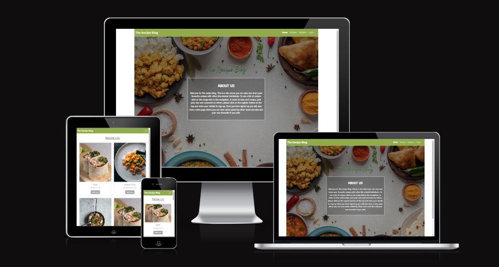
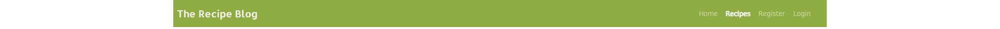
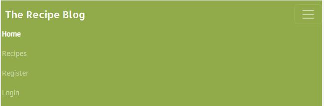
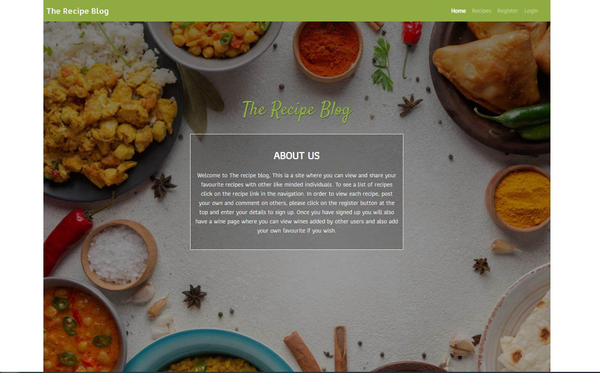

# The Recipe Blog
The Recipe Blog is a website that I built using the Dajngo Full Stack framework for my Portfolio Porject 4. The Recipe
Blog is a site that allows users to view and share their favourite recipies and also view and share their favourite wines.
They are able to comment underneath recipes and also like them. Users need to be logged in to get the full
functionality of the site.
  
  

[Click Here To Visit Live Site](https://the-recipe-blog1.herokuapp.com/)  

## Table Of Contents:
1. [UX Design](#ux-design)
2. [Features](#features)
3. [Future Features](#future-features)
4. [Technologies Used](#technologies-used)
5. [Testing](#testing)
6. [Bugs](#bugs)
6. [Deployment](#deployment)
7. [Credits](#credits)
8. [Acknowledgements](#acknowledgements)

## UX Design:

## Features:

### Navigation Bar
- The Navigation bar sits at the very top of each page, The logo is at the right hand side and the navigation links are on the left.
- The Navbar background is green with the Navigation links and Logo in white colored text.
- On large to xx-large screens the navigation bar is in the center of the page and is sized by the bootstrap [container-lg](https://getbootstrap.com/docs/5.0/layout/containers/) class.
- The active page(page that the user is current on) is displayed in bold text, this makes it stand out much more and is clear to the user which page they are on.
- When on medium to small screens the navigation menu changes to burger menu which show all the nav links when clicked on.(second screenshot below)
  
  

**Nav bar on mobile and tablets**  

 

### Footer
- The footer is found at the bottom of every page and responsive for tablet and mobile too.
- It displays 4 icons for the biggest scoial media platfoms today, Twitter, Facebook, Youtube and Instagram. These are all green in color to match the sites colour scheme
- Above the icons there is a horizontal line that is centered, and it is 30% of the screen with on large devices, 50% on medium and 60% on small devices.
- When any of the icons are clicked the social media site opens on a seperate tab, this way the user still has the Fitness 365 website open so they can easily navigate back to it.
  
 
- - -  

### Home Page
- The home page has a background image of food on a table and has a light black linear gradiant to darken the image a bit and bring up the text color.
- In the center there is a H1 heading that says"The Recipe Blog" in green.
- Below the heading there is a text box that explains what the site is about, the text box has a white border around it and the backgound is abit darker, the text is then in white shich really makes it stand out.

 
