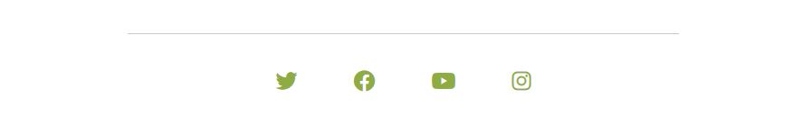
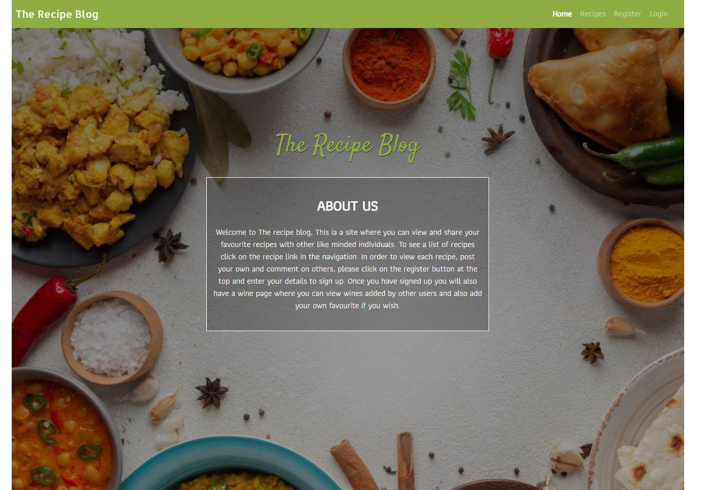
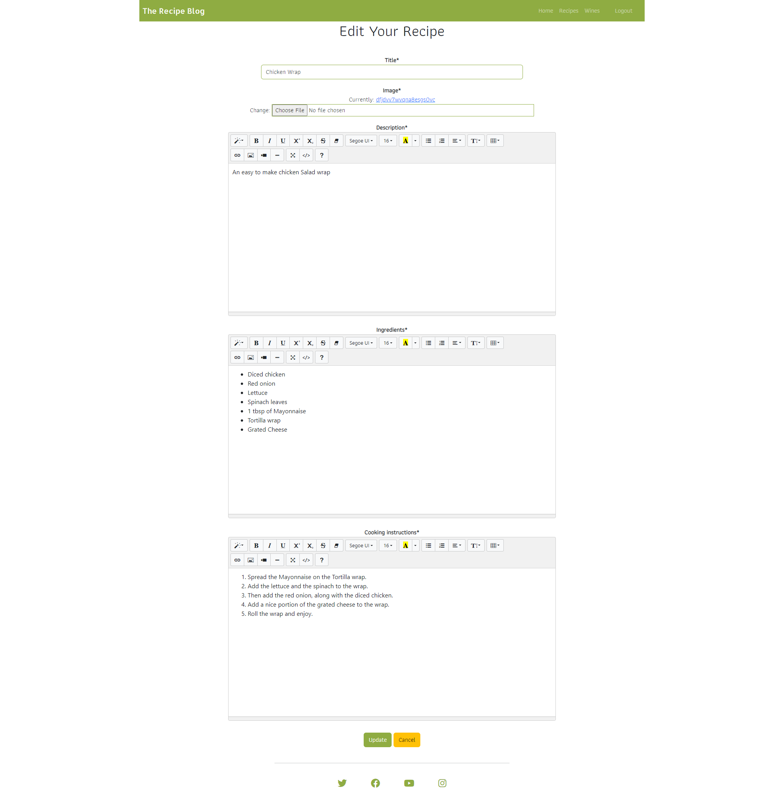

# The Recipe Blog
The Recipe Blog is a website that I built using the Dajngo Full Stack framework for my Portfolio Porject 4. The Recipe
Blog is a site that allows users to view and share their favourite recipies and also view and share their favourite wines.
They are able to comment underneath recipes and also like them. Users need to be logged in to get the full
functionality of the site.
  
  

[Click Here To Visit Live Site](https://the-recipe-blog1.herokuapp.com/)  

## Table Of Contents:
1. [UX Design](#ux-design)
2. [Features](#features)
3. [Future Features](#future-features)
4. [Technologies Used](#technologies-used)
5. [Testing](#testing)
6. [Bugs](#bugs)
6. [Deployment](#deployment)
7. [Credits](#credits)
8. [Acknowledgements](#acknowledgements)

## UX Design:

## Features:

### Navigation Bar
- The Navigation bar sits at the very top of each page, The logo is at the right hand side and the navigation links are on the left.
- When logged in some of the links change, like the **Login** becomes **Logout** and the **Registeration** link is removed and **Wine** linke added.
- The Navbar background is green with the Navigation links and Logo in white colored text.
- On large to xx-large screens the navigation bar is in the center of the page and is sized by the bootstrap [container-lg](https://getbootstrap.com/docs/5.0/layout/containers/) class.
- The active page(page that the user is current on) is displayed in bold text, this makes it stand out much more and is clear to the user which page they are on.
- When on medium to small screens the navigation menu changes to burger menu which show all the nav links when clicked on.(second screenshot below)
  
  

**Nav bar on mobile and tablets**  

 

### Footer
- The footer is found at the bottom of every page and responsive for tablet and mobile too.
- It displays 4 icons for the biggest scoial media platfoms today, Twitter, Facebook, Youtube and Instagram. These are all green in color to match the sites colour scheme
- Above the icons there is a horizontal line that is centered, and it is 30% of the screen with on large devices, 50% on medium and 60% on small devices.
- When any of the icons are clicked the social media site opens on a seperate tab, this way the user still has the Fitness 365 website open so they can easily navigate back to it.
  
 
- - -  

### Home Page
- The home page has a background image of food on a table and has a light black linear gradiant to darken the image a bit and bring up the text color.
- In the center there is a H1 heading that says **The Recipe Blog** in green.
- Below the heading there is a text box that explains what the site is about, the text box has a white border around it and the backgound is abit darker, the text is then in white shich really makes it stand out.

 
- - -  

### Recipes Page
- At the top of the recipes page, right below the Nav bar there is a H1 heading that says **Recipes List** which is underlined and centered.
- Below this are the recipes cards which are displayed in the bootstrap card format and have six to a page.
- The **read more** button is greyed out when the user is logged out and is green when the user is logged in(second screeshot)
- Above the recipes on the left hand side there is a green **Add Recipe** button, this button is only displayed if the user is logged in.
- On Large screens they are three accross, on medium devices they are two accross and on small deavices it is just one.
- Below the recipe cards there will be a next and back button depending on how many recipes have been added.  

**Recipes page when user is logged in** 

  
[Back to the top](#the-recipe-blog)
- - -    
  
### Recipe Details
- At the top of the of the redipe details page in the center is the photo of the recipe.
- If the user who nposted the recipe is looking at it then delete and edit button are at the top right.
- Below the image and center d is the title of the recipe and the autor who has posted it.
- Below the image to the left you have a like button that shows how many people liked the recipe, the heart will be empty outline and 0 next to it if no one hads liked it, and it will be filled red if liked.
- Underneath the like button you have **Description**, **Ingredients** and **Cooking Instructions** fields.
- Then there is the comment section below this, which has a H2 heading that says **Comment Section**, The comment section has a border around it, and comments have a light grey backgound colour, which makes them stand out. The authors name and date is displayed below the comment and there is an edit and delete button in the top right of the comment which is only visible to the author of the comment.
- Below this is the **Post a Comment** section which has has border around it. Inside is the **info** text area where the user can enter their comment ans then below that is the green **Post** button.

- - -   

### Add Recipe Page
- When a user clicks the **Add Recipe** button on the recipes page they are taken to the **Add Recipe page** where they are greeted with a form to enter their recipe.
- At the top there is a H1 heading that says **Add Your Recipe below** with the form fields beneath it. I kept the form big and simple, so that it is for the user to use and everything is centered.
- For the **Description**, **Ingredients** and **Cooking Instructions** fields the summernote widget is used so that a user can easily format their text and style it whatevr way they wish.
- Below this is a **Submit** button that is in green and once clicked the recipe will be submitted and the user returns to the recipe page where they will see their recipe as first in the list.
- Beside the **Submit** button there is a orange **Cancel** button that once clicked will bring the user back to the recipe page.
  

---

### Edit Recipe Page
- The **Edit Recipe page** is accessed when the user clicks the edit recipe pencil icon on the recipe details page.
- This is practically the same as the **Add Recipe page**. The only difference is that the form is already filled in with the details you entered before so that you can change them, and also the heading says **Edit Your Recipe**
- Please note that only the user who created the recipe can edit it from here.

- - -

### Delete Recipe
- When a user clicks on the delete icon on the recipe details page a boot strap modal pops up in the center and ask the user to confirm.
- The modal is a square box with a grey background, with a heading that says **Delete Recipe** and  text center asks **Are you sure you want to delete the recipe**.
- At the bottom right of the modal box is a red **Yes** button to confim if they want to delete it. The button is red becuase red is associated with danger and if clicked the recipe will be gone. Once click the recipe will be deleted and the user witll be returned to the recipes page.
- Beside the **Yes** button there is a **Cancel** button, that when clicked will make the modal disappear, there is also an **x** in the Top right of the modal that will also get right of it.
- If the user clicks anywhere else on the screen the modal will also disapear.
- Please note that only the user who created the recipe can delete it from here.

### Edit comment Page
- When the edit comment icon is clicked at the right of the comment, the user is brought to the edit comment page.
- This is just a bigger version of the **Post a Comment** section on the recipe details page, but it has the comment message you posted in the **info** box for you to edit.
- Above this ther is a heading tells you to **Edit the comment you posted on the certain date and time**
- There is an green **update** button below the text box that when clciked will update the comment bring you back to the recipe details page where you can view your updated comment.
- Beside this is an amber **Cancel** button that returns the user to recipe details page, if they decide not to update the comment.
- Please note that only the user who created the comment can edit it from here.