## Table Of Contents:
1. [Validator Testing](#vadilidator-testing)
    * [Html](#html)
    * [CSS](#css)
    * [JavaScript](#javascript)
    * [Python](#python)
    * [Lighthouse](#lighthouse)
    * [GTmetrix](#gtmetrix)
    
2. [Browser and Deivce Testing](#browser-and-device-testing)
3. [User Story Testing](#user-story-testing)
4. [Manual Testing](#manual-testing)
5. [Bugs](#bugs)

## Validator Testing

### HTML
All the site pages were run through the W3C validator to check for any issues and HTML syntax errors. The W3C validator can be found [here](https://validator.w3.org/). As you can see from the below screenshots there are no errors.

    
Home Page
  
    
  

  

    
Recipes page
  
    
  

  

    
Wines Page
  
    

  
  

    
Add Wine Page
  
    

 

    
edit Wine Page
  
    

 

    
Register Page
  
    

 

    
Login Page
  
    

 

    
Logout Page
  
    

 

The **Add Recipe** and **Edit Recipe** pages threw errors in the Validator that were related to the Django **Summernote** widget that I used. From searching on slack, speaking to tutor support  and also talking to my mentor I was told that this is common with summernote and as I had not written the summernote code, I could ignore these errors as long as my code validated and make a note of it in the readme. These errors do not affect the site functionality in any way. Below you can see a screenshot of the errors.

- - -

### CSS
- The CSS stylesheet was put through the W3C Jiqsaw validator to see if there was any errors. The W3C Jiqsaw validator can be found [here](https://jigsaw.w3.org/css-validator/)  .
- As you can see from the below screenshot of the result there were no errors.

  
- - -

### JavaScript
- The Javascript file was put through Jshint code validator to see if there were any errors. Jshint can be found [here](https://jshint.com/).
- The first screenshot was the orginal Javascript that I was using for the Settimeout but for some reason it was giving a **Uncaught typeError** in the console, even though the site was working fine. I tried many ways to get rid of the error but I could not so then I eventually found a way to do it with Jquery. I have left the screenshot in for reference as to how I was first doing it. The second screenshot is the current JS that I am using and it has no errors.

  

**Current JS File**  
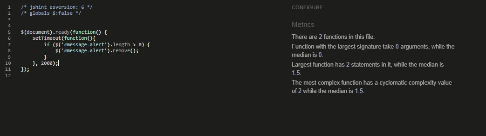  
- - -

### Python
- I tested the project using the PEP8 validator in gitpod, this I had installed from my previous project, but it can be installed by running **pip3 install pycodestyle** then searching for **Python**, Select **Linter** and then select **pycodestyle**. The PEP8 erorrs would then be underlined in red and also listed in **Problems tab**. This returned no errors.
- I also tested the site on **Code Institutes pep8 online** website. Which can be found [here](https://pep8ci.herokuapp.com/). As you can see from the below screenshots, no errors were found.

##### Meals App

    
admin.py
  
    
  

  

    
forms.py
  
    
  

  

    
models.py
  
    

  
  

    
urls.py
  
    

  

    
views.py
  
    

  

##### Wines App

    
admin.py
  
    
  

  

    
forms.py
  
    
  

  

    
models.py
  
    

  
  

    
urls.py
  
    

  

    
views.py
  
    

  

*Just to note, the settings.py file gave some **line too long** errors which are related to the default authorization, which I was told can be ignored in this file so I added the **Noqa** comment to them so that the linter would not read them.*

[Back to the top](#table-of-contents)
- - - 

### Lighthouse
Lighthouse in chrome dev tools was used to generate a report that tests the sites **Performance**, **Accessibility**, **Best Practices** and **Seo**. 

    
Home
  
    

    
Recipes
  
    
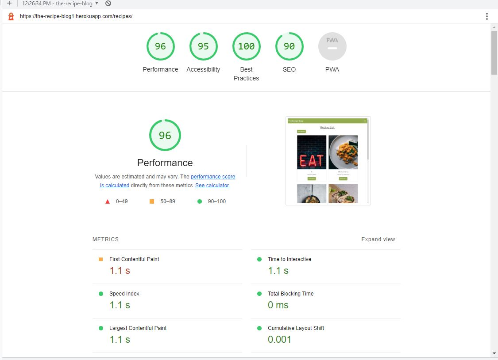

    
Add Recipe
  
    
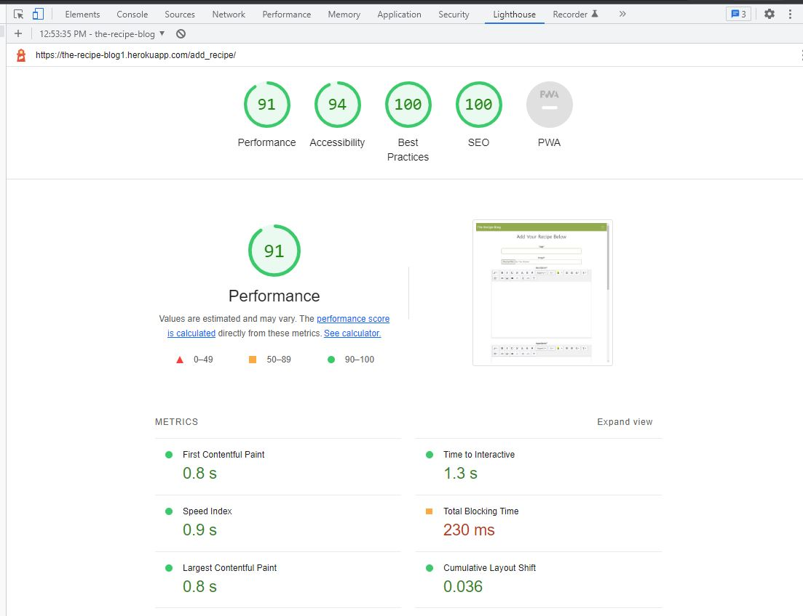

    
Wines
  
    
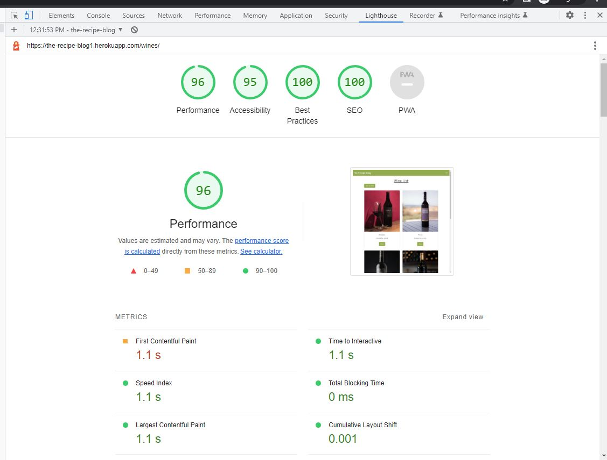

    
Add Wine
  
    
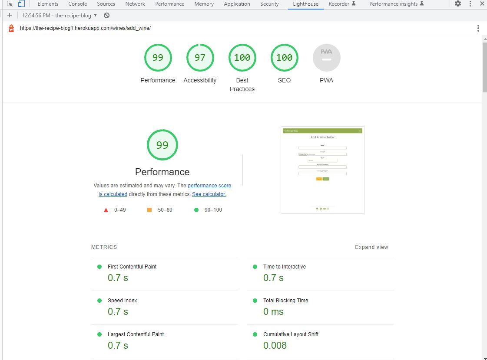

    
Register
  
    

    
Login
  
    
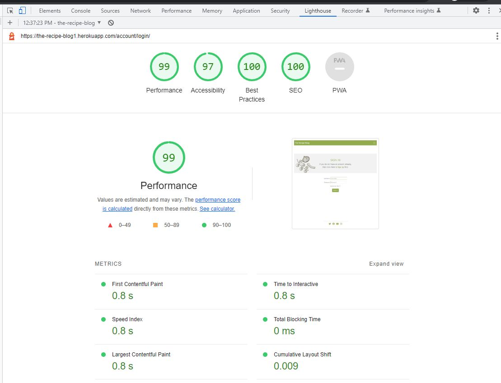

    
Logout
  
    
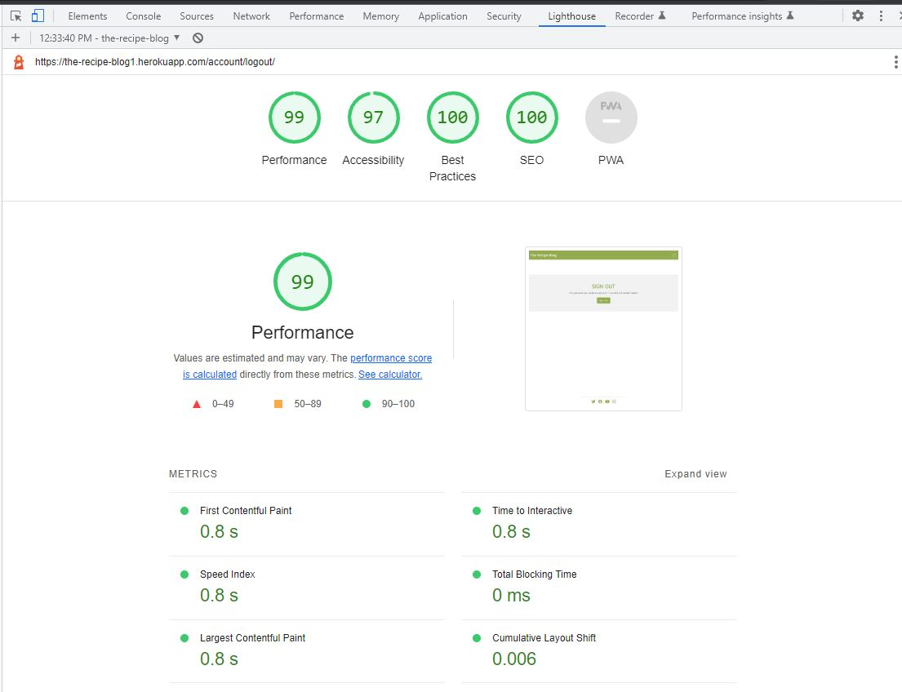

  

*Just to note on the recipes page if I change the **Read more** button to **View** or **Read** the SEO goes from 90 to 100, I had a look on stack overflow and some people have had the same issue it seems like Lighouse has an issue with some words, also adding a **aria-label** tag does not increase it. I have left the button as **Read More**.*
- - - 

### GTmetrix
I also tested the sites performance on GTMetrix.

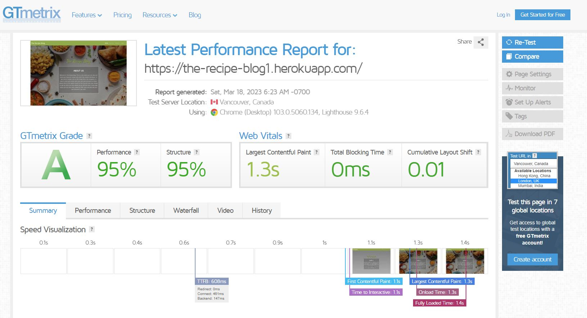

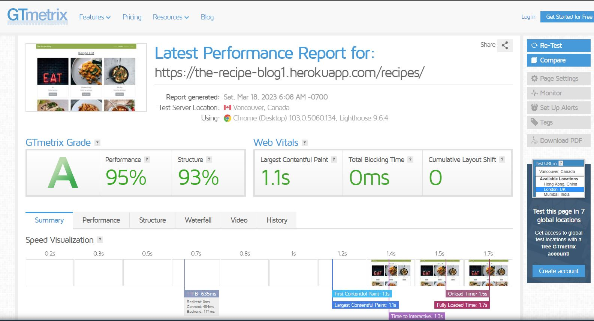

- - - 

## Browser and Device Testing
- In order to make sure the site was fully responsive and compatible with different browsers and devices, I tested the site on multiple browsers and devices. 
- The browsers I tested the site on **Chrome**, **Edge** and **Firefox**, when using **Chrome** I was able to use the dev tools and test the site on many different device sizes  like **iPhones 5, 6, 7, 8, X, SE and 12 pro**, **iPad mini and air** , and **Samsung s9+ and s20 ultra**, the site worked as expected on all.
- I also tested the site on a number of real mobile and tables, the devices I tested on were **Samsung S8 and a53**, **iPad 7** and **iPhone 7 and 11**.
- From testing the site on multiple browsers and devices, along with different screen widths, I can confirm that the site is fully responsive and compatible with multiple browsers and devices as you will see from the screenshots below.

#### Browser Screenshots

    
Chrome
  

  

    
Edge
  

  

    
Firefox
  

    
Chrome Dev tools Iphone 5
  

  

    
Chrome Dev tools Iphone 6, 7, 8
  

  

    
Chrome Dev tools Iphone SE
  

  

    
Chrome Dev tools Iphone X
  

  

    
Chrome Dev tools Iphone 12 Pro
  

  

    
Chrome Dev tools Ipad Mini
  

  

    
Chrome Dev tools Ipad air
  

  

    
Chrome Dev tools Samsung S9 
  

  

    
Chrome Dev tools Samsung S20 Ultra
  

  
- - - 

#### Real Device Screenshots

    
Samsung a53
  

  

    
 iPhone 11
  

  

    
 iPad 7
  

  

    
 Samsung S8
  

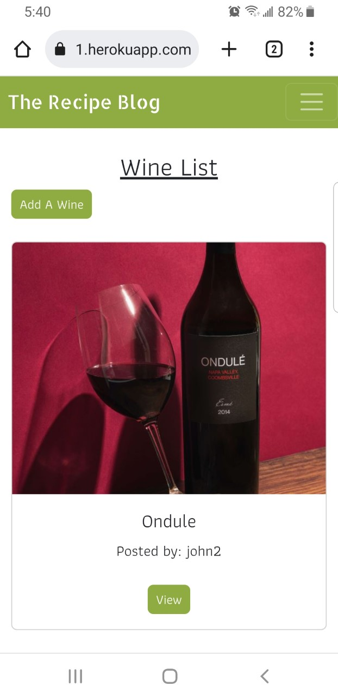

  

    
 iPhone 7
  

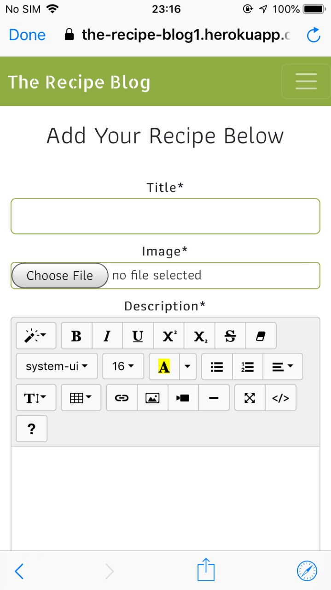

  
- - - 

## User Story Testing

##### Navigation
*As a User I can easily navigate around the website so that I can view different pages and sections of the site.*
 - The Navigation at the top of the page is easy to navigate and the current page link is bold which clearly indicates what page you are on.

#### Register
*As a User I can Create an account so that I can view recipe details and add my own.*
 - In the Navigation bar at the top of the page, if a User clicks on the Register link, they will be brought to the registeration page wehere they can sign up, once they sign up they will be able to access full functionality of the site.
 
#### Login | Logout
*As a User I can Sign-in/ Sign-out so that can access features when signed in and sign-out so that no one can access my account.*
 - When a User is not logged in the login link will be visible in at the far right in the navigation bar, the same link will change to logut when the user is logged in.
 - When the User enters their login credentials they wil be able to access the full fuctionality of the site, when the user is logged out they will not have full access on the site and their account will be secure.

#### About The site
*As a User I want to understand what the site is about.*
 - On the home page is an About us section that cleary tells the user what the site is about and how to use it.

#### View Recipes
*As a User I can view the list of recipes so that I can pick one to read.*
 - The user is able to click the recipes link in the nav bar and this will take them to the recipes page where they can view a list of recipes.
 - If they wish to view one in full detail they can click Read More and they will then be able to see the recipe details, the user must be signed in to view the recipe details as if they are not signed in the Read More button will be diabled.

#### Add A Recipe
*As a User I can add a recipe so that other people can view it.*
 - When a user is signed in they are able to click on the Add Recipe button on the Recipes page, which will bring them to the Add Recipes page where they are able to upload their recipe.

 #### Edit / Delete A recipe
 *As a User I can Edit/Delete my recipes so that I can make changes even after I have posted a recipe.*
  - When viewing a recipe that the User has uploaded in the top right corner they have a choice to either delete or edit the recipe. A user can only edit or delete a recipe they have added.

 #### Like Recipes
 *As a User I can like recipes so that I can show that I like a recipe without having to comment.*
  - On the recipe details there is a like button below the image, it is a Love heart that is empty outline when not liked and then is filled when liked, beside it displays the number of people that like the recipe. A User must be logged in to access this functionality.

#### Add A Comment
*As a User I can comment on other recipes so that I can provide feedback.*
 - When a user is signed in and they are on the recipe details page for a particular recipe, at the bottom of the page there is a comment section where they can add a comment.

#### Edit / delete A comment
*As a User I can update my comments so that I can make changes incase I mistyped something or if I wish to delete the comment.*
 - The User is able to edit or delete any comment that they have created by clicking on the edit or delete button in the right hand side of that comment.

### View Wines
*As a User I can see the list of wines so that I can pick one to view.*
 - The User must be signed in or the Wines link in the Nav bar will not be visible, if the User is signed in they can select Wines in the Nav bar and this will take them to the Wines page where they can selct a wine to view.

#### Add A Wine
*As a User I can add a wine that I like so that other people can see it*
 - When a user is signed in they are able to click on the Add A Wine button on the Wine page, which will bring them to the Add Wine page where they are able to upload a Wine.

 #### Edit / Delete A Wine
 *As a User I can Edit/Delete my Wines so that I can make changes even after I have posted a Wine.*
  - In the Wine Detail page there is an edit and delete button at the bottom of the Wine card, which will allow the user to delete or edit the wine that they posted.

#### Administer The Site
*As a Site admin  I can administer the site so that I can manage the sites content.*
 - A super User account was created so that the site can be fully managed from the Admin panel.

[Back to the top](#table-of-contents)
 - - - 

## Manual Testing

#### Navigation
| Feature               | Test Performed                                                     | Result  |
|-----------------------|--------------------------------------------------------------------|---------|
| Logo | Clicking on logo to see if it redirects to home page.                               | Pass    |
| Home | Clicking on Home link brings user to the home page.                                 | Pass    |
| Recipes | Clicking on the recipe link, brings user to the recipe page.                      | Pass    |
| Wines | When signed in clicking on the wine link, brings user to the wines page.           | Pass    |
| Register | When signed out clicking on the Register link, brings the user to the Registeration page.   | Pass    |
| Login | When signed out, clicking on the Login link, brings the user to the login page.    | Pass    |
| Logout | When signed in, clicking on the logout link, brings the user to the logout page.  | Pass    |
| Correct links display | When a user is signed in or out the correct links display for both.   | Pass    |
| Displays correctly on all pages | Made sure it displays correctly on all pages.               | Pass    |
| Current Page | Nav Link is bold for current page that a user is on.                        | Pass    |
| Responsiveness | Checked to make sure it changes to burger menu on smaller devices.         | Pass      |

#### Footer
| Feature               | Test Performed                                                     | Result  |
|-----------------------|--------------------------------------------------------------------|---------|
| External links | Clicking on social media links opens on a new page.                             | Pass    |
| Displays correctly on all pages | Made sure it displays correctly on all pages.            | Pass    |
| Responsiveness | Checked to make sure link icons display correctly on smaller devices.     | Pass    |

#### Home
| Feature               | Test Performed                                                     | Result    |
|-----------------------|--------------------------------------------------------------------|-----------|
| Responsiveness | Checked Page on many different devices, browser and screen widths.        | Pass      |
| Background Image | Checked to make sure background image loads correctly.                  | Pass      |
| About Us Section | Make sure section displays correctly on all device widths               | Pass      |

#### Recipes
| Feature               | Test Performed                                                     | Result    |
|-----------------------|--------------------------------------------------------------------|-----------|
| Responsiveness | Checked Page on many different devices, browser and screen widths.        | Pass      |
| Recipe cards   | Check to make sure recipe cards display correctly.                        | Pass      |
| 6 Recipes Per Page | Make sure that there is only 6 recipes per page.                      | Pass      |
| Read more button | Allow user to click the read more button under each recipe, when they are signed in.    | Pass      |
| Read more button |Dont allow user to click the read more button under each recipe, when they are signed out.    | Pass      |
| Add recipe Button | Display an Add Recipe button, when the user is signed in.              | Pass      |
| Next button | Display a next button at the bottom of the page if there is more than six recipes.    | Pass      |
| Back button | Display a back button at the bottom of the page if the user is on the next recipe page. | Pass      |

#### Recipe Details Page
| Feature               | Test Performed                                                     | Result    |
|-----------------------|--------------------------------------------------------------------|-----------|
| Responsiveness | Checked Page on many different devices, browser and screen widths.        | Pass      |
| Recipe Content   | Make sure the recipe content displays correctly.                         | Pass      |
| Edit Recipe   | Allow user to click the edit button to edit their recipe, if they posted the recipe.            | Pass      |
| Delete Recipe   | Allow user to click the delete button to delete their recipe, if they posted the recipe.      | Pass      |
| Signed in user access  | Only allow a singed in user access to the recipe details page.    | Pass      |
| Like button   | Display a like button below the recipe and allow it to be clicked.         | Pass      |
| Display total number of like   | Display the number of people that like the recipe.        | Pass      |
| Comment Section  | Display any comments that were added in the comment section.            | Pass      |
| Post Comment   | Allow user to post a comment and display it in the comment section        | Pass      |

#### Add A Recipe Page
| Feature               | Test Performed                                                     | Result    |
|-----------------------|--------------------------------------------------------------------|-----------|
| Responsiveness | Checked Page on many different devices, browser and screen widths.        | Pass      |
| Display form  | Check to see if all input fields display.                                  | Pass      |
| Submit filled out form  | Fill out all the form and click the submit button at the bottom of the page. | Pass      |
| Leave Image field blank on submission  | Check to make sure image place holder displays after submititng. | Pass      |
| Leave Input fields blank | Check to make sure form wont submit, and will display warnings. | Pass      |
| Submit Button | On click it will submit the recipe, and bring the user to the recipes page where the newly added recipe can be seen. | Pass      |
| Cancel Button | On click it will bring the user back to the recipes list.                  | Pass      |
| Success Message | Success message is displayed at the top of the screen when a user clicks Submit.  | Pass      |

#### Update A Recipe Page
| Feature               | Test Performed                                                     | Result    |
|-----------------------|--------------------------------------------------------------------|-----------|
| Responsiveness | Checked Page on many different devices, browser and screen widths.        | Pass      |
| Display form  | Check to see if all input fields display with the orginal recipe.                                  | Pass      |
| Update form  | Update the form and click the submit button at the bottom of the page and check if the recipe has been updated. | Pass      |
| Update Button | On click it will Update the recipe, and bring the user to the recipes page where the updated recipe can be seen. | Pass      |
| Cancel Button | On click it will bring the user back to the recipes list.                  | Pass      |
| Success Message | Success message is displayed at the top of the screen when a user clicks update.  | Pass      |

#### Delete A Recipe Modal
| Feature               | Test Performed                                                     | Result    |
|-----------------------|--------------------------------------------------------------------|-----------|
| Responsiveness | Checked Page on many different devices, browser and screen widths.        | Pass      |
| Yes Button | When the user clicks the yes button the recipe will be deleted.                 | Pass      |
| Cancel Button | When th user clicks the cancel button, the delete modal will disappear and the user will be back on the recipe page.     | Pass      |
| Clicking Outside The Modal | When the user clicks anywhere ouside the modal the modal will disappear.    | Pass      |
| X  | When the user clicks on the X button at the top of the modal, the modal disappears.   | Pass      |
| Success Message | Success message is displayed at the top of the screen when a user clicks yes on the delete modal.  | Pass      |

#### Wines
| Feature               | Test Performed                                                     | Result    |
|----------------|--------------------------------------------------------------------|-----------|
| Responsiveness | Checked Page on many different devices, browser and screen widths.        | Pass      |
| Wine Cards   | Check to make sure wine cards display correctly.                            | Pass      |
| 6 Wine Per Page | Make sure that there is only 6 wine cards per page.                      | Pass      |
| View Button | Allow user to click the View button under each Wine.                         | Pass      |
| Add Wine Button | Display an Add Wine button.             | Pass      |
| Next button | Display a next button at the bottom of the page if there is more than six wines.    | Pass      |
| Back button | Display a back button at the bottom of the page if the user is on the wine page that is not the first.    | Pass      |

#### Wine Details Page
| Feature               | Test Performed                                                     | Result    |
|-----------------------|--------------------------------------------------------------------|-----------|
| Responsiveness | Checked Page on many different devices, browser and screen widths.        | Pass      |
| Wine Content   | Make sure the Wine content display correctly.                         | Pass      |
| Edit Wine   | Allow user to click the edit button to edit their Wine, if they posted the Wine.            | Pass      |
| Delete Wine   | Allow user to click the delete button to delete their Wine, if they posted the Wine.      | Pass      |
| Signed in user access  | Only allow a singed in user access to the Wine details page.    | Pass      |

#### Add A Wine Page
| Feature               | Test Performed                                                     | Result    |
|-----------------------|--------------------------------------------------------------------|-----------|
| Responsiveness | Checked Page on many different devices, browser and screen widths.        | Pass      |
| Display form  | Checked to see if all input fields display.                                  | Pass      |
| Submit filled out form  | Fill out all the form and click the submit button at the bottom of the page. | Pass      |
| Leave Input and Image fields blank | Check to make sure form wont submit, and will display warnings. | Pass      |
| Submit Button | On click it will submit the Wine, and bring the user to the Wines page where the newly added Wine can be seen. | Pass      |
| Cancel Button | On click it will bring the user back to the Wines list.                  | Pass      |
| Success Message | Success message is displayed at the top of the screen when a user clicks Submit  | Pass      |

#### Update A Wine Page
| Feature               | Test Performed                                                     | Result    |
|-----------------------|--------------------------------------------------------------------|-----------|
| Responsiveness | Checked Page on many different devices, browser and screen widths.        | Pass      |
| Display Form  | Check to see if all input fields display with the orginal wine details.                                  | Pass      |
| Update Form  | Update the form and click the submit button at the bottom of the page and check if the Wine has been updated. | Pass      |
| Update Button | On click it will Update the Wine, and bring the user to the Wines page where the updated Wine can be seen. | Pass      |
| Cancel Button | On click it will bring the user back to the Wines list.                  | Pass      |
| Success Message | Success message is displayed at the top of the screen when a user clicks update  | Pass      |

#### Delete A Wine Modal
| Feature               | Test Performed                                                     | Result    |
|-----------------------|--------------------------------------------------------------------|-----------|
| Responsiveness | Checked Page on many different devices, browser and screen widths.        | Pass      |
| Yes Button | When the user click the yes button the Wine will be deleted.                 | Pass      |
| Cancel Button | When th user clicks the cancel button, the delete modal will dissapear and the user will be back on the Wine detail page.     | Pass      |
| Clicking Outside The Modal | When the user clicks anywhere ouside the modal the modal will dissapear.    | Pass      |
| X  | When the user clicks on the X button at the top of the modal, the modal dissapears.   | Pass      |
| Success Message | Success message is displayed at the top of the screen when a user clicks yes on the delete modal  | Pass      |

#### Register Page
| Feature               | Test Performed                                                     | Result    |
|-----------------------|--------------------------------------------------------------------|-----------|
| Responsiveness | Checked Page on many different devices, browser and screen widths.        | Pass      |
| Sign In link | Under the "already have an account section", click Sign in to see if it brings you to the login page        | Pass      |
| Submit Filled Out Form  | Fill out the form and click the Signup button to see if new account is created. | Pass      |
| Leave Email Field Blank  | Fill out all the form except the optional email field and hit submit to see if new account is created.| Pass      |
| Leave Username Field Blank| Fill out the form and leave Username field blank, to see if it give a warning and does not Sign Up.| Pass      |
| Leave Password Field Blank| Fill out the form and leave Password field blank, to see if it give a warning and does not Sign Up.| Pass      |
| Leave Password (again) Field Blank| Fill out the form and leave Password (again) field blank, to see if it give a warning and does not submit.| Pass      |
| Signup with an taken username| Try to register an account that already has the taken username, and see if it fails and warns you that there is an account with that username. | Pass      |
| Signup Button | On click check will it submit the user details and log them in if everything is filled out correctly. | Pass      |
| Success Message | Success message is displayed at the top of the screen when a user enters the correct details and clicks Sign Up. | Pass      |

#### Login Page
| Feature               | Test Performed                                                     | Result    |
|-----------------------|--------------------------------------------------------------------|-----------|
| Responsiveness | Checked Page on many different devices, browser and screen widths.        | Pass      |
| Sign Up link | Under the "if you do not have an account" section, click Sign up to see if it brings you to the Register page        | Pass      |
| Leave Username Field Blank| Fill out Password Field and leave Username field blank, to see if it give a warning and does not Sign in.| Pass      |
| Leave Password Field Blank| Fill out the Username field and leave Password field blank, to see if it give a warning and does not submit.| Pass      |
| Sign In with unregistered account | Try to sign in with an account that is not registered, to see if it will fail. | Pass      |
| Change on letter in username or password | On click check will tell the user that the username or password is incorrect | Pass      |
| Sign In Button | On click check will it log the user in if they have entered the right credentials and redirect them to the home page. | Pass      |
| Success Message | Success message is displayed at the top of the screen when a user enters the correct details and clicks Sign in. | Pass      |

#### Logout Page
| Feature               | Test Performed                                                     | Result    |
|-----------------------|--------------------------------------------------------------------|-----------|
| Responsiveness | Checked Page on many different devices, browser and screen widths.        | Pass      |
| Sign Out Button | Check to see if it will sign the user out and redirect them to the login page.  | Pass      |
| Success Message | Success message is displayed at the top of the screen after clicking Sign Out to let the user know they have logged out. | Pass      |

- - - 

## Bugs

### Fixed
- After creating the project I was getting alot of PEP8 errors, most of which were for **lines too long** as you can see in the below screenshot. To fix this and conform to PEP8 standards I broke the lines up and made sure they did not go past 79 characters.
- With the orginal JS file I had for the setTime out function, it was throwing a **Uncaught TypeError: Cannot read properties of null** error in the console. The site was working fine with this but I could not get rid of the error in the console, I tried many things from youtube and stack overflow but I could not get rid of the error until I found one way that showed how to do the same thing with jquery. This solution did not produce any errors in the console and worked exactly the same.
- I had an issue where I could not get the delete comment modal to work when I was placing it down at the bottom of the page, I got stuck on this longer that I would like to admit, The reason it would not work was becuase it was outside the django template language forloop in the the **display comment section** of the html so all I had to do was move it up to be in the forloop and then it worked.

[Back to the top](#table-of-contents)

