## Validator Testing

### HTML
- All the site pages were run through the W3C validator to check for any issues and HTML syntax errors. The W3C validator can be found [here](https://validator.w3.org/). As you can see from the below screenshots there are no errors.

### CSS
- The CSS stylesheet was put through the W3C Jiqsaw validator to see if there was any errors. The W3C Jiqsaw validator can be found [here](https://jigsaw.w3.org/css-validator/)  .
- As you can see from the below screenshot of the result there were no errors.

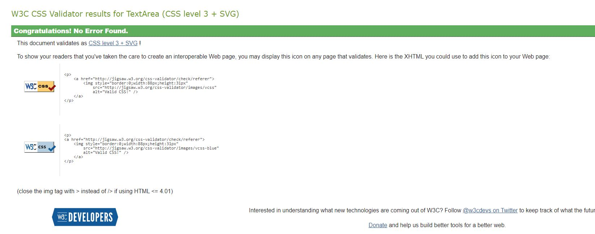  
- - -

### JavaScript
- The Javascript file was put through Jshint code validator to see if there were any errors. Jshint can be found [here](https://jshint.com/).
- As you can see from the below screenshot, there were no errors.

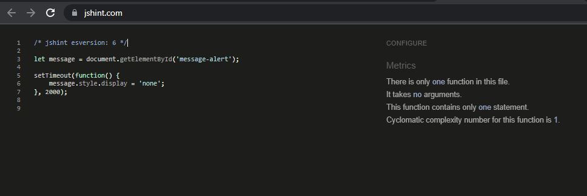  
- - -

### Python
- I tested the app using the PEP8 validator in gitpod, this I had installed from my previous project, but it can be installed by running **pip3 install pycodestyle** then searching for **Python**, Select **Linter** and then select **pycodestyle**. The PEP8 erorrs would then be underlined in red and also listed in **Problems tab**. This returned no errors.
- I also tested the site on **Code Institutes pep8 online** website. Which casn be found [here](https://pep8ci.herokuapp.com/). As you can see from the below screenshots, no errors were found.

##### Meals App

    
admin.py
  
    
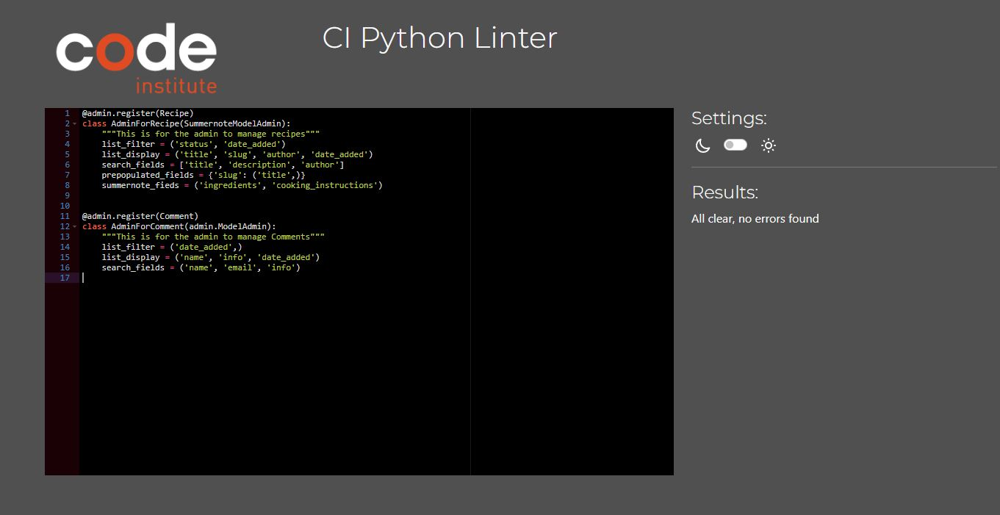  

  

    
forms.py
  
    
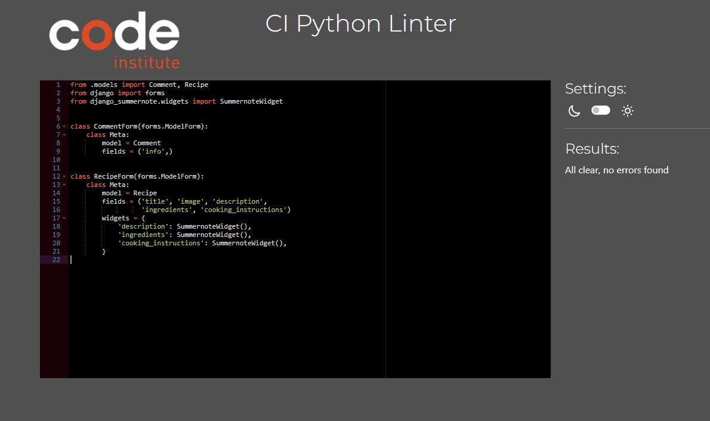  

  

    
models.py
  
    
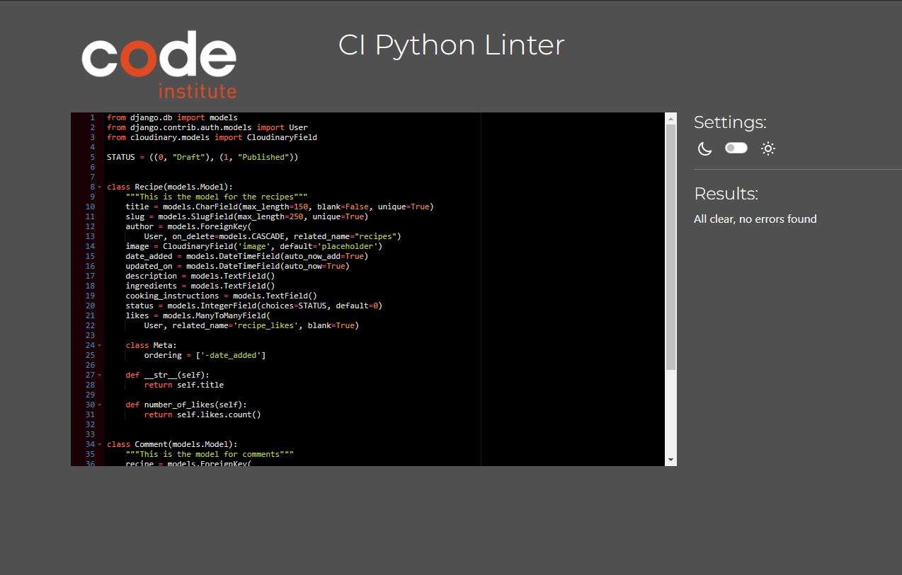

  
  

    
urls.py
  
    
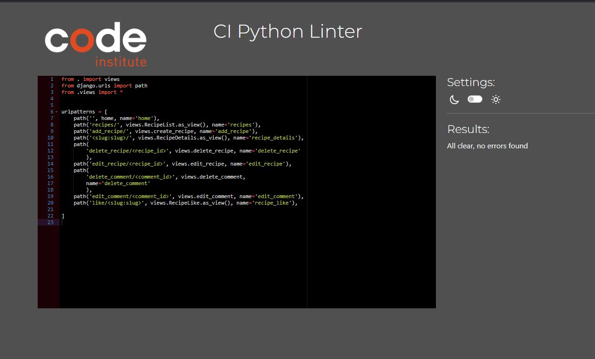

  

    
views.py
  
    
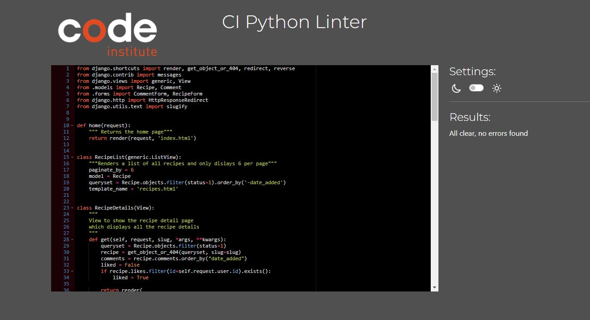

  

##### Wines App

    
admin.py
  
    
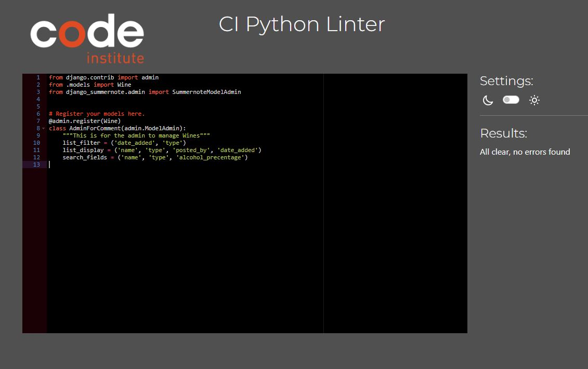  

  

    
forms.py
  
    
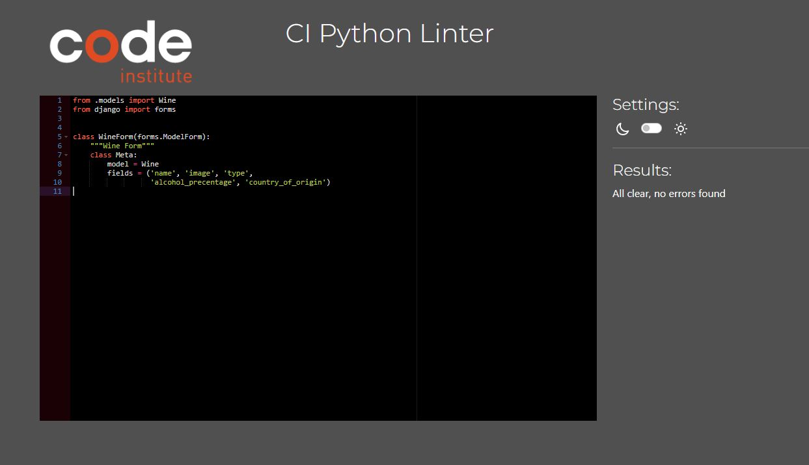  

  

    
models.py
  
    
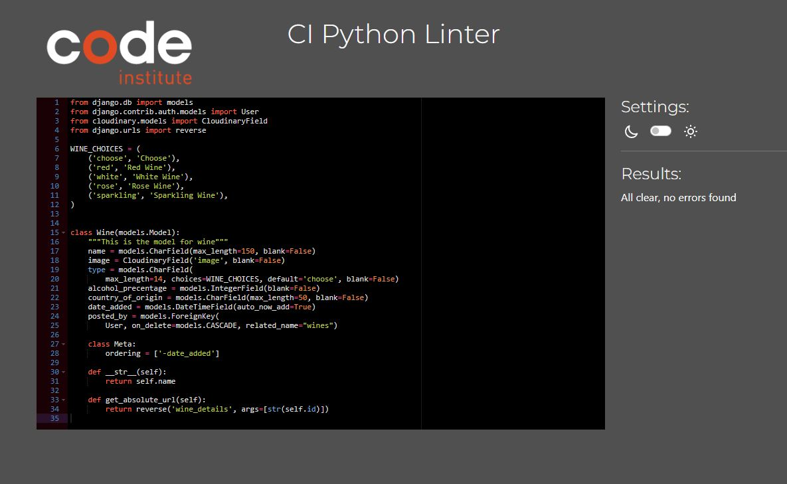

  
  

    
urls.py
  
    
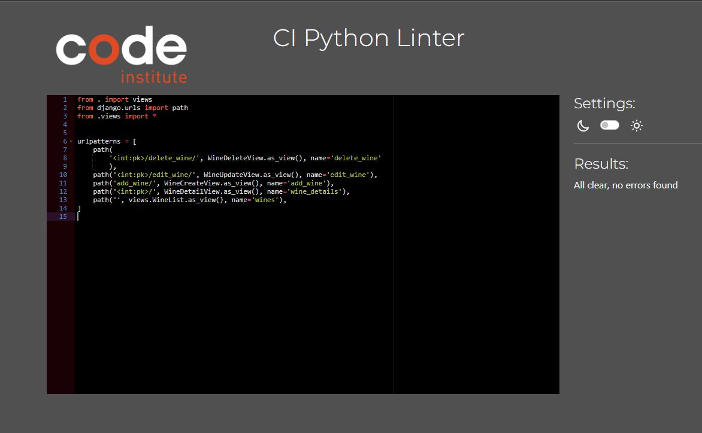

  

    
views.py
  
    
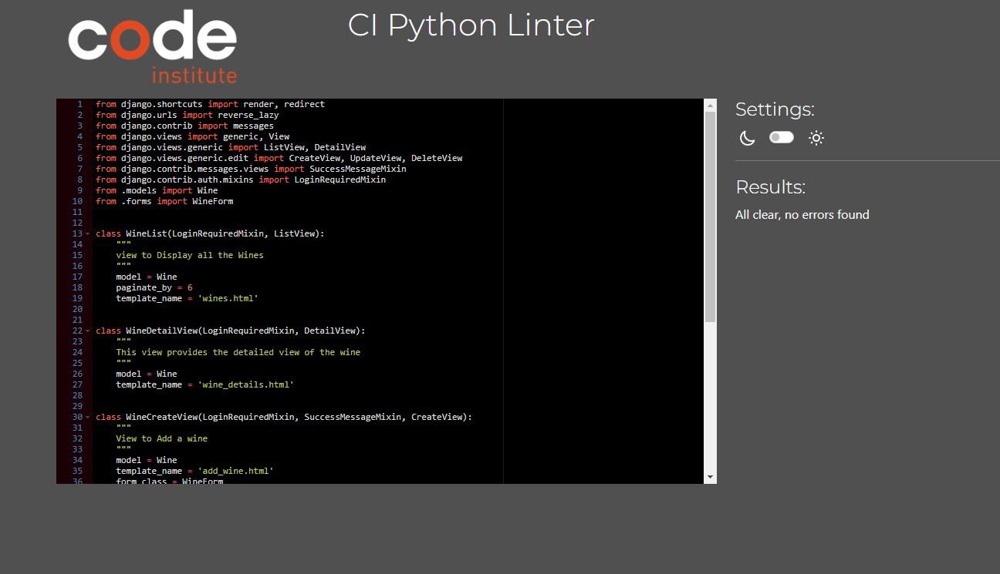

  

**#** Just to note, the settings.py file gave some **line too long** errors which are related to the default authorization, which I was told can be ignored in this file.
- - - 